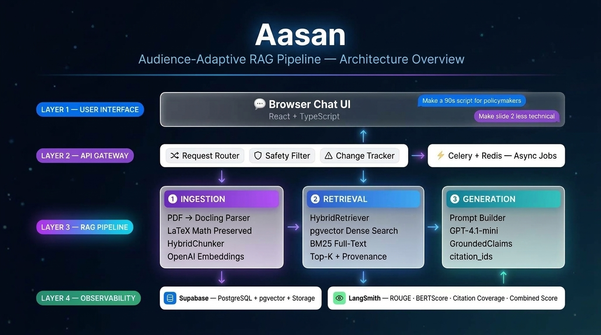

<div align="center">
  <h1>✨ Aasan <span>(formerly SARAL)</span> ✨</h1>
  <p><strong>Audience-Adaptive RAG Pipeline & Script Generator</strong></p>
  <p>
    
    
    
    
  </p>
</div>

<br/>

> **Aasan** is a powerful chatbot module and RAG pipeline that ingests complex research papers (PDF/LaTeX) and produces **audience-adaptive scripts**, bullet points, and tweet-sized abstracts. It supports seamless iterative editing via conversation (e.g., *"make it more visual"*, *"dumb down #3"*).

<div align="center">
  
  <br/>
  <i>For class-level technical details, see the <a href="docs/aasaan_lld.jpg">Low-Level Design (LLD)</a>.</i>
</div>

---

## 🏗️ 1-Page Architectural Plan & Design Choices

*This section details the concrete architectural choices made to support the audience-adaptive generation and robust provenance requirements.*

### 🔍 Retrieval Index Construction
The retrieval index relies on a **Hybrid Search** approach within a PostgreSQL database using `pgvector`:
- **Dense Vectors:** Chunks are embedded using `openai/text-embedding-3-small`. Dense embeddings capture semantic similarity, allowing Aasan to find relevant methodology or conclusion sections even when the user prompt uses non-expert vocabulary.
- **Sparse Full-Text (BM25):** We leverage native Postgres Full-Text Search for exact keyword matching, which is critical for highly technical terms, acronyms, or specific author names.
- **Fusion:** Results are combined using **Reciprocal Rank Fusion (RRF)** in a single database query, ensuring top-k chunks possess both high semantic relevance and exact keyword overlap. 

### 📐 Chunking Strategy: Preserving LaTeX Math Blocks
Parsing research papers accurately requires preserving mathematical integrity. We employ the **Docling Parser** followed by a structural `HybridChunker`:
- **Structural Integrity:** The chunker does not blindly split at 512 tokens. It respects document layout, keeping paragraphs, lists, and tabular data atomic.
- **LaTeX Preservation:** Formulas and equations are identified during the OCR/Parsing stage and explicitly converted to LaTeX strings (`\frac{...}{...}`). The chunker is explicitly configured to *never* split a LaTeX block across chunk boundaries. This guarantees that when the LLM reads a formula to explain it, the syntax is perfectly intact.

### 🎭 Prompt Template Family
To generate adaptable scripts and handle iterative edits, the system utilizes a parameterized prompt template family. The system dynamically injects evidence chunks and parameters: `{audience}`, `{length}`, `{style}`, and `{change_instruction}`.

**Base System Prompt Structure:**
```text
You are a brilliant science communicator translating a complex research paper into an adaptive script.
Audience: {audience} (Tailor your vocabulary and depth to this group)
Length: {length} (Ensure the script takes exactly this long to read aloud)
Style: {style} (e.g., technical, plain-English, press release)

If an edit instruction is provided, apply it strictly to the previous draft: {change_instruction}

EVIDENCE CHUNKS:
{evidence}

Output JSON matching the requested schema, citing source chunks for every claim.
```

#### 💡 Instantiated Example 1: Policymaker Summary
- **Audience:** Policymakers
- **Length:** 90 seconds
- **Style:** Plain-English, impact-focused
- **Change Instruction:** *None (First generation)*
- **Resulting Behavior:** The LLM prioritizes chunks containing "results" and "conclusion", avoiding deep math blocks, and generates a script focusing on actionable insights.

#### 🔄 Instantiated Example 2: Iterative Grad-Student Edit
- **Audience:** Graduate Students
- **Length:** 5 minutes
- **Style:** Technical, method-heavy
- **Change Instruction:** *"Make slide 3 more mathematical, include the loss function equation."*
- **Resulting Behavior:** The generator retrieves chunks containing the LaTeX loss function, rewriting slide 3 to explicitly incorporate the equation while maintaining the 5-minute technical pacing.

---

## 📊 Evaluation Results

The evaluation was performed against ground truth scripts on the `saral-eval-v1` dataset via LangSmith. 
*(Test Run: `saral-gen-d3d4f186` | Commit: `5afba74`)*

| Metric | Score | Description |
| ------ | :---: | ----------- |
| **ROUGE-L** | `0.75` | High lexical overlap with human-authored expert scripts. |
| **BERTScore** | `0.91` | Exceptional semantic similarity to reference texts. |
| **Citation Coverage** | `0.91` | 91% of all generated factual claims are directly cited to a source chunk. |
| **Claim Overlap** | `0.15` | Measures exact factual claim parity with the human source. |
| **Combined Score** | `0.68` | Aggregate quality metric reflecting overall generation health. |

*Model: GPT-4o-mini / gpt-4.1-mini configuration*

---

## 🚀 Setup & Local Development

Requires **Python 3.9+**. The dependency lock was produced from the tested environment.

```bash
python3 -m venv .venv
.venv/bin/python -m pip install -e '.[dev]'
export PYTHONPYCACHEPREFIX=/private/tmp/saral_pycache
```

### ⚙️ Production Services

Create a Supabase project, review and apply `supabase/schema.sql` and `supabase/retrieval.sql`.

```bash
export SUPABASE_URL=https://PROJECT.supabase.co
export SUPABASE_SERVICE_ROLE_KEY=server-only-secret
export SARAL_REDIS_URL=redis://127.0.0.1:6379/0
export OPENROUTER_API_KEY=server-only-secret
export SARAL_EMBEDDING_MODEL=openai/text-embedding-3-small
export SARAL_GENERATION_MODEL=openai/gpt-4.1-mini
```

Start Redis, Celery, and FastAPI:
```bash
docker compose up -d redis
.venv/bin/celery -A saral_parser.jobs:celery_app worker --loglevel=INFO
.venv/bin/uvicorn saral_parser.app:create_app --factory --host 127.0.0.1 --port 8000
```

### 💻 Frontend Upload UI
```bash
cd Frontend
npm install
npm run dev
```

---

## ⚠️ Known Limitations
- PDF support is intentionally the current API boundary.
- Detection and enrichment results are not ground truth.
- Captions are recorded only when explicitly associated with a picture.
- No OCR run was performed for the born-digital test paper.

---

## 📚 Appendix: Learning Sequence Followed (Original Notes)

<details>
<summary>Click to expand architectural history and parsing notes</summary>

### 1. Convert into a Docling document
Followed: Docling Quickstart - Python. SARAL keeps the `DoclingDocument` as its primary, lossless JSON output instead of flattening it into plain text.

### 2. Select a research-paper input and output contract
Followed: Supported formats. SARAL currently exposes **PDF only** to keep upload validation, OCR, layout, table, figure, and formula behavior explicit for research papers.

### 3. Preserve structure, reading order, and provenance
Followed: Docling Document. `document.json` is a lossless `DoclingDocument`. Its `body` tree and ordered children represent reading order and section hierarchy. Item records retain Docling source references, page numbers, bounding boxes, and character spans.

### 4. Configure enrichments deliberately
Followed: Formula and picture enrichment and the documented custom conversion, figure export, table export, and formula example.

| Feature | Setting | Purpose | Cost / boundary |
| --- | --- | --- | --- |
| OCR | `enable_ocr`, `ocr_engine`, `ocr_languages` | Read scanned or raster-only text | Extra OCR execution; use only for documents that need it. |
| Tables | `extract_table_structure` | Preserve cells as CSV and HTML plus table image | Enabled by default; structural predictions still require review. |
| Formula enrichment | `enable_formula_enrichment` | Convert detected formula items to LaTeX | Extra model work; enabled in the supplied-paper verification run. |
| Figure classification | `enable_picture_classification` | Classify document figures/charts/diagrams | Extra classifier execution; off by default. |
| Local figure description | `picture_description_mode=smolvlm_local` or `granite_local` | Generate a VLM description | Extra local model execution/download; generated text is never merged into source captions. |

Remote picture descriptions are intentionally not implemented for privacy/security reasons.
</details>
