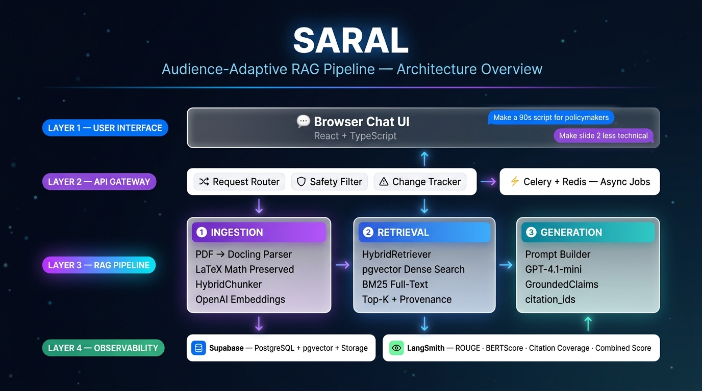

# SARAL RAG Pipeline & Audience-Adaptive Script Generator Plan

## 1. Architecture Overview
The SARAL system utilizes a 4-layer architecture to handle complex document processing, retrieval, and audience-adaptive generation:
- **User Layer:** React/TypeScript UI for PDF uploads and iterative natural language edits.
- **API & Queue Layer:** FastAPI backend that dispatches long-running parsing and generation jobs to a Celery/Redis queue.
- **RAG Pipeline (Core):** 
  - **Ingestion:** Docling parser that retains structural hierarchy and LaTeX math.
  - **Retrieval:** Hybrid `pgvector` + `BM25` search for finding exact facts and mathematical formulas.
  - **Generation:** LLM Prompt Builder parameterized by Audience, Length, and Style.
- **Storage & Observability:** Supabase for vector storage and LangSmith for real-time evaluation (ROUGE-L, BERTScore).

<div align="center">
  
</div>


## 2. Retrieval Index Construction & Chunking Strategy
### Chunking Strategy (Preserving LaTeX Math)
To ensure that mathematical integrity is maintained, the chunking strategy relies on structural boundaries rather than arbitrary token counts:
- **Docling Native Parsing:** Extracts documents into semantic blocks (paragraphs, tables, equations).
- **Block-Level Chunking:** Chunks are created by grouping semantic blocks up to a token limit, but a math block (`$$...$$` or `\begin{equation}...\end{equation}`) is **never split**. 
- **Metadata Tagging:** Each chunk retains metadata such as `page_numbers`, `heading`, and a unique `chunk_id`.


### Index Construction
- **Hybrid Search Index:** We index chunks in Supabase using `pgvector` (for semantic similarity of concepts) and `BM25` (for exact keyword and formula matching). 
- **Reciprocal Rank Fusion (RRF):** Results from both vector and keyword searches are merged to retrieve the most relevant evidence, particularly useful for isolating exact equations.

## 3. Formula Parsing Pipeline
Formula parsing is handled rigorously at every step:


- **Ingestion:** Docling accurately identifies math elements and outputs them as raw LaTeX without dropping symbols.
- **Retrieval:** Both dense embeddings and sparse BM25 representations retain LaTeX syntax, allowing queries for specific mathematical variables (e.g., `\mathbf{W}`).
- **Generation (Prompt Builder):** The `grounding_rules` enforce strict mathematical fidelity. The LLM is instructed to:
  - **Never simplify or alter** LaTeX macros (e.g., copy `\mathbf{W}` exactly).
  - Wrap all mathematical formulas in standard markdown math delimiters (`$$` for blocks, `$` for inline).
  - Place citations *before* block equations to prevent rendering breaks.
  - **Double-escape** all LaTeX backslashes (`\\alpha`) to prevent JSON parsing crashes during structured output generation.

## 4. Intent Analysis & Iterative Edits
When a user submits a natural language edit, the system performs **Intent Analysis** to update the generation parameters:
- **Parameters:** 
  - `{audience}` (policymakers, grad students, press)
  - `{length}` (30s, 90s, 5min)
  - `{style}` (technical, plain-English, press release)
  - `{change_instruction}` (e.g., "focus more on the empirical results")


The system parses the user's request, classifies the intent, and maps it to the nearest parameter constraints, injecting the explicit `{change_instruction}` into the prompt builder for the revision.

## 5. Prompt Template Family & Prompt Builder
The Prompt Builder dynamically constructs the context using validated `request`, `evidence`, and `grounding_rules` blocks. The core generation instruction is parameterized as follows:

```text
You are an expert technical communicator writing a {length} script for {audience}.
The tone should be {style}.

{change_instruction}

Use the provided <evidence_pack> to ground every claim.
```

### Instantiated Example 1 (The Policymaker Pitch)
- **{audience}:** Policymakers
- **{length}:** 90s
- **{style}:** plain-English
- **{change_instruction}:** "Emphasize the economic impact and remove complex derivations."
- **Resulting Prompt Context:** "You are an expert technical communicator writing a 90s script for Policymakers. The tone should be plain-English. Emphasize the economic impact and remove complex derivations. Use the provided <evidence_pack>..."

### Instantiated Example 2 (The Deep Dive)
- **{audience}:** Grad students
- **{length}:** 5min
- **{style}:** technical
- **{change_instruction}:** "Include the full objective function and explain the optimization constraints."
- **Resulting Prompt Context:** "You are an expert technical communicator writing a 5min script for Grad students. The tone should be technical. Include the full objective function and explain the optimization constraints. Use the provided <evidence_pack>..."

