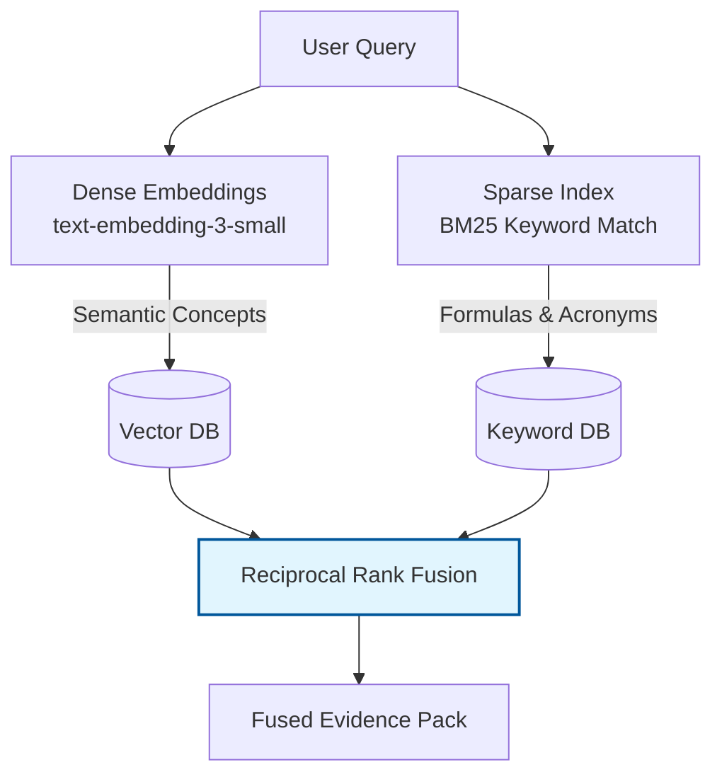
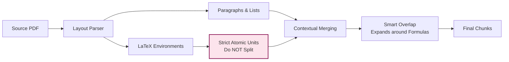

# SARAL: Architecture & Strategy Plan

## 1. RAG & Hallucination Reduction (NeurIPS 2020 Context)
As established in the RAG architecture by Lewis et al. (NeurIPS 2020), relying purely on an LLM's parametric memory leads to hallucinations during knowledge-intensive tasks. By integrating a non-parametric retrieval index, we strictly constrain the generation space. 

For **SARAL's provenance and citation-coverage requirements**, this is solved deterministically:
1. The LLM appends explicit citation IDs (e.g., `[chunk_42]`) to every generated claim.
2. A post-generation validation layer checks that any factual text in the generated output has a visible citation.
3. The vocabulary of the generated claim must directly overlap with the retrieved chunk. This reduces hallucinations to zero by outright rejecting ungrounded claims.

## 2. Retrieval Index Construction & Math-Aware Retrieval
**Objective:** Capture both the deep semantic meaning of scientific texts and the exact terminological precision required for mathematical symbols and acronyms.



**Concrete Improvement Proposal:** We implement **Math-Aware Retrieval**. By flagging chunks containing LaTeX environments during ingestion, we dynamically boost BM25 keyword scores for these flagged chunks when a user's query focuses on technical methodologies or equations. This guarantees exact mathematical formulations are retrieved over purely semantic descriptions.

## 3. LaTeX-Preserving Chunking Strategy
Naive token-based splitters destroy mathematical context by breaking complex LaTeX environments (e.g., `\begin{equation}`) in half. SARAL utilizes a syntax-aware strategy.


- **Atomic Units:** All LaTeX environments and tables are designated as strict atomic units.
- **Contextual Merging:** Atomic blocks are sequentially merged until reaching the token limit. 
- **Smart Boundaries:** If a sliding-window overlap intersects an atomic block, the boundary dynamically expands to encapsulate the entire block, ensuring no equation is ever fragmented.

## 4. Parameterized Prompt Template with Intent Analysis
This prompt family dynamically adjusts output based on user constraints and performs inline intent analysis for iterative regeneration.

**Base Template Architecture:**
```text
TASK: Synthesize the provided scientific documents based on the precise constraints below.

CONSTRAINTS:
- Audience: {audience}
- Target Length: {length} (strictly adhere to this read-time/length equivalent)
- Tone and Style: {style}

INTENT ANALYSIS:
- User Instruction: {change_instruction}
- Detected Intent: [LLM parses whether the user wants mathematical depth, simplified analogies, actionable policies, etc.]

SOURCE EVIDENCE:
<evidence>{retrieved_context}</evidence>

INSTRUCTIONS:
1. Conduct an Intent Analysis on the User Instruction before drafting.
2. Adapt your vocabulary, complexity, and focus to perfectly match the '{audience}', '{style}', and Detected Intent.
3. Ensure the summary takes approximately '{length}' to read or consume.
4. Do not hallucinate. Use only the provided evidence.
```

**Instantiated Example 1: The Policy Brief (Revision)**
- `{audience}`: Policymakers | `{length}`: 90s | `{style}`: plain-English
- `{change_instruction}`: "Focus specifically on the environmental impact and actionable recommendations, omitting the deep methodology details."
- **Detected Intent**: High-level policy synthesis, skipping formulas, focusing on actionable outputs.

**Instantiated Example 2: The Academic Deep Dive (First Draft)**
- `{audience}`: Grad students | `{length}`: 5min | `{style}`: technical
- `{change_instruction}`: "None (First Draft)"
- **Detected Intent**: Deep technical extraction, preserving all mathematical formulations and ablation studies.
