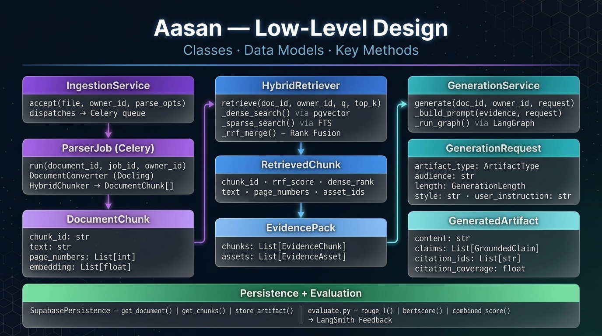

# Aasan (formerly SARAL) — Complete Architecture

This document outlines the full end-to-end architecture of the Aasan RAG Pipeline and Audience-Adaptive Script Generator. It is broken down into two levels: the **High-Level Design (HLD)** which maps the user journey and system boundary, and the **Low-Level Design (LLD)** which maps internal class structures and data models.

---

## 1. High-Level Design (HLD)

The High-Level Architecture showcases the core 4-layer flow:
1. **User Layer:** A React/TypeScript UI for uploading PDFs and submitting natural language edits.
2. **API Layer:** FastAPI backend dispatching long-running jobs to a Celery/Redis queue.
3. **RAG Pipeline (Core):**
   - **Ingestion:** Docling parser that retains structural hierarchy and LaTeX math.
   - **Retrieval:** Hybrid pgvector + BM25 search to locate exact facts and formulas.
   - **Generation:** LLM Prompt Builder that parameterizes for Audience, Length, and Style.
4. **Storage & Observability:** Supabase for vector data and LangSmith for real-time evaluation metrics (ROUGE-L, BERTScore).

  

---

## 2. Low-Level Design (LLD)

The Low-Level Architecture dives into the Python classes and database models powering the backend:
- `IngestionService` and `ParserJob` manage file validation and Docling integration.
- `HybridRetriever` orchestrates the dual-query logic and Reciprocal Rank Fusion (`_rrf_merge()`).
- `GenerationService` and `GenerationRequest` handle strict output enforcement and citation grounding.

  

