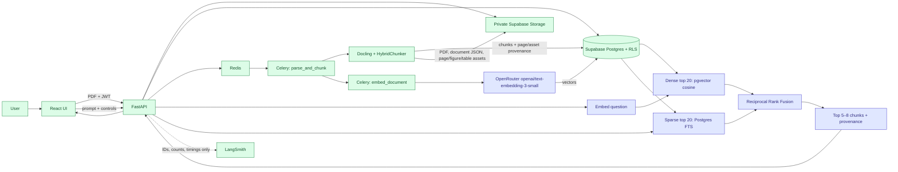

# SARAL architecture

For the complete current architecture and low-level design—including chunk metadata, private image
delivery, retrieval, grounding, and conversations—see [full-architecture.md](full-architecture.md).

SARAL preserves source structure before indexing it. The parser stores immutable PDF and image
assets privately, while each chunk keeps page numbers, source references, bounding boxes, and
related `asset_ids`. Text embeddings are an additional index on those rows—not a replacement for
the original PDF, page images, figures, tables, or provenance.



## Retrieval and grounding boundaries

- `parse_and_chunk` completes before `embed_document` starts. A failed embedding job leaves the
  parsed document and its assets intact and sets only `embedding_status=failed`.
- Vectors are stored on `document_chunks`; captions and heading context are part of
  `contextualized_text`. Figure/table IDs, pages, and source references remain response metadata.
- Dense and sparse queries both filter by the verified `owner_id` and `document_id` inside
  server-only Postgres functions. Browser roles cannot invoke those functions.
- Retrieval returns the fused chunks with their `chunk_id`, pages, headings, source references,
  full provenance, and related figure/table `asset_ids`, ready for a future generator and citation UI.

## Request sequence

```mermaid
sequenceDiagram
    participant UI as React UI
    participant API as FastAPI
    participant DB as Supabase Postgres
    participant R as Redis
    participant PW as Parser worker
    participant EW as Embed worker
    participant O as OpenRouter

    UI->>API: POST /v1/documents (PDF)
    API->>DB: queued document + parse job
    API->>R: parse_and_chunk
    R->>PW: parse job
    PW->>DB: chunks + source/page/asset provenance
    PW->>DB: queued embedding job
    PW->>R: embed_document
    R->>EW: embedding job
    EW->>O: bounded contextualized-text batches
    O-->>EW: ordered vectors
    EW->>DB: vector rows; embedding_status=ready
    UI->>API: POST /retrieve
    API->>O: embed question
    API->>DB: dense and sparse searches in parallel
    API-->>UI: fused cited chunks with provenance
```
