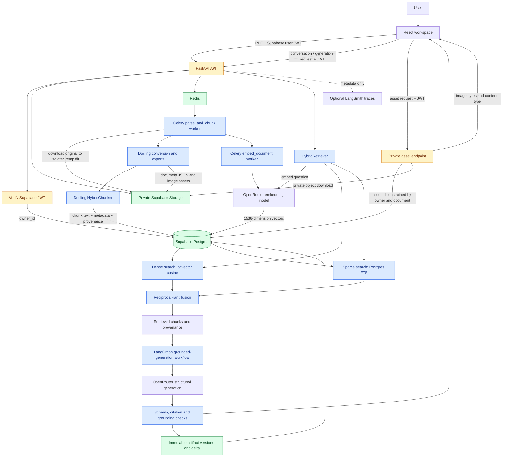
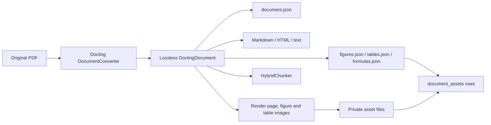
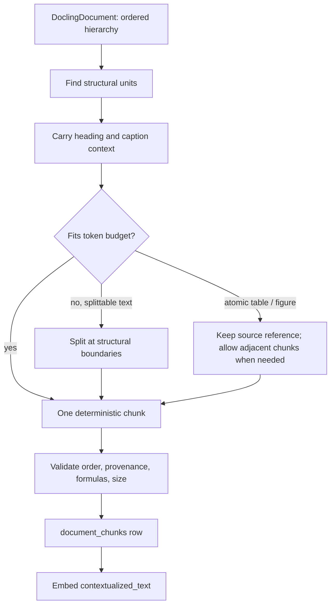
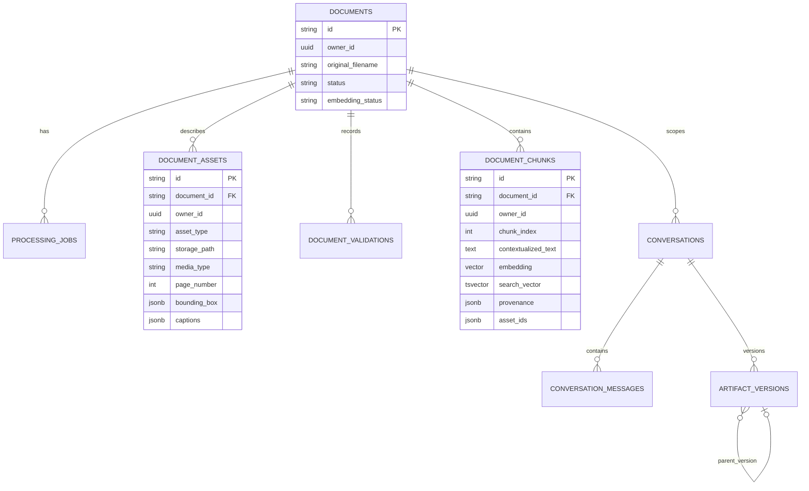
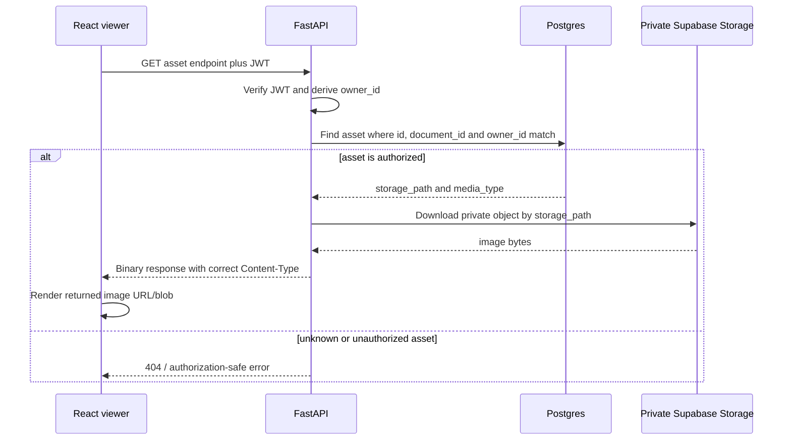
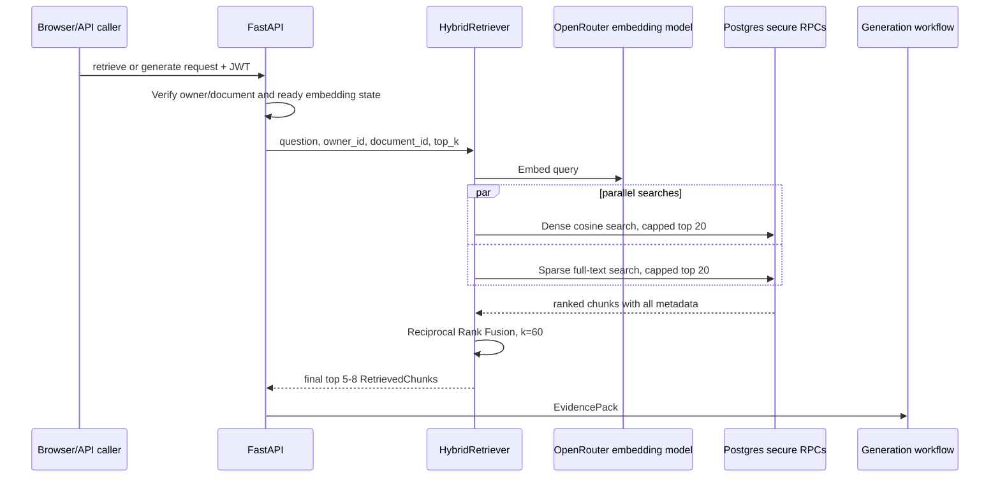
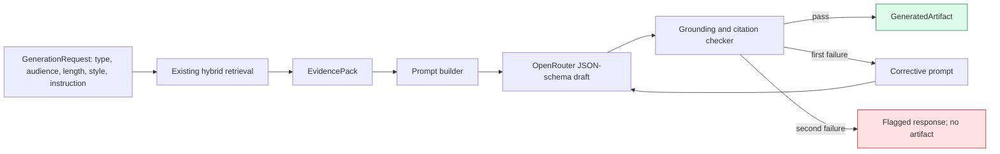
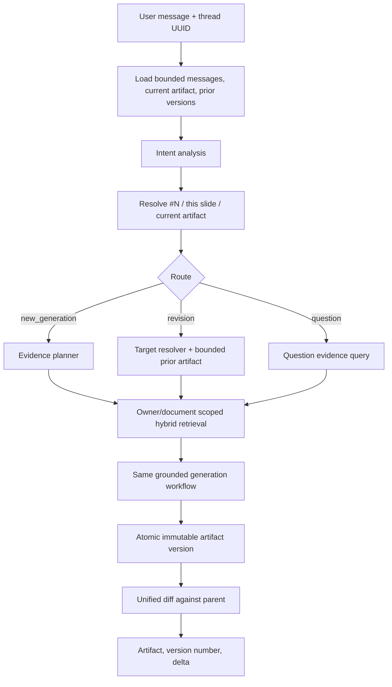

# SARAL full architecture and low-level design

This is the architecture SARAL implements today. It describes the path from a user uploading a
research-paper PDF to retrieving cited evidence, creating grounded artifacts, revising them, and
fetching a document image safely. It distinguishes persisted facts (PDFs, chunks, metadata, and
versions) from derived indexes (embeddings and full-text search).

## 1. System at a glance



### Responsibilities

| Component | Responsibility | Does not own |
| --- | --- | --- |
| React workspace | Selects a PDF, polls document status, sends generation/conversation requests, and renders returned citations/versions. | Database access, storage credentials, retrieval, or model prompts. |
| FastAPI | Authentication, input validation, authorization boundary, API contracts, job dispatch, and streaming asset bytes. | Long-running parsing/model work. |
| Redis + Celery | Separates slow parsing and embedding work from the HTTP request. | User-facing authorization decisions. |
| Docling | Builds a structural `DoclingDocument`, extracts text/tables/figures/formulas, and exports visual assets. | Search index or user-visible generation. |
| HybridChunker | Converts structure into bounded, ordered evidence chunks. | Embeddings and access control. |
| Supabase Storage | Holds private binary/source artifacts. | Querying chunks or deciding authorization. |
| Supabase Postgres | Holds document records, metadata, chunks, vectors, jobs, messages, and immutable versions. | Direct browser access to private object paths. |
| HybridRetriever | Finds owner- and document-scoped evidence using dense and lexical search. | Generating text. |
| Generation/conversation graphs | Turn evidence into validated, citation-grounded artifacts and persist versions. | Treating chat history as evidence. |

## 2. Trust and ownership boundary

Every request starts with a verified Supabase user JWT. The API derives `owner_id` from that token;
the browser never supplies an owner ID it can choose. Document, chunk, asset, conversation, and
artifact-version reads are constrained by both `owner_id` and `document_id`.

The Supabase service-role key is server/worker-only. It is never delivered to `Frontend/`. Storage
objects are private; the browser receives an asset only after the API has checked the matching
`document_assets` row. Postgres RLS and server-only database functions provide a second access
boundary for retrieval and version writes.

## 3. Low-level design: upload, parsing, and indexing

```mermaid
sequenceDiagram
    participant UI as React workspace
    participant API as FastAPI
    participant DB as Postgres
    participant S as Private Storage
    participant R as Redis
    participant PW as Parse worker
    participant EW as Embed worker
    participant O as OpenRouter embeddings

    UI->>API: POST /v1/documents (multipart PDF, options, JWT)
    API->>API: Validate MIME, size, options, JWT
    API->>S: Upload owner/document/original/paper.pdf
    API->>DB: Insert documents = queued and processing_jobs = queued
    API->>R: Enqueue parse_and_chunk(job_id)
    API-->>UI: 202 document_id, job_id, status_url
    UI->>API: GET document status (poll)
    API-->>UI: queued / processing / ready / failed

    R->>PW: parse_and_chunk
    PW->>DB: Mark parsing job processing
    PW->>S: Download original into worker temp directory
    PW->>PW: Docling conversion, exports, validation, HybridChunker
    PW->>S: Upload document JSON, exports, page/figure/table assets
    PW->>DB: Insert asset metadata, validation report, ordered chunk rows
    PW->>DB: Create embedding job
    PW->>R: Enqueue embed_document(job_id)

    R->>EW: embed_document
    EW->>DB: Read chunks missing embeddings
    EW->>O: Embed contextualized_text in bounded batches
    O-->>EW: Vectors in input order
    EW->>DB: Secure RPC writes vectors; embedding_status = ready
```

`POST /v1/documents` returns quickly because it only accepts and records work. A document can be
parsed successfully while embedding fails: its source files and chunks remain usable for diagnosis,
but retrieval/generation stays unavailable until `embedding_status` becomes `ready`.

### Persisted paths

The same logical artifact has a production and local location:

| Artifact | Production private storage key | Local diagnostic output |
| --- | --- | --- |
| Original PDF | `{owner_id}/{document_id}/original/paper.pdf` | User-supplied source; never rewritten. |
| Lossless Docling model | `{owner_id}/{document_id}/parsed/document.json` | `outputs/{document_id}/document.json` |
| Readable exports | `{owner_id}/{document_id}/parsed/...` | `outputs/{document_id}/` Markdown, HTML, text and structured JSON exports |
| Page, figure, table images | `{owner_id}/{document_id}/assets/...` | `outputs/{document_id}/assets/...` |
| Validation and manifest | `{owner_id}/{document_id}/diagnostics/...` | `outputs/{document_id}/validation_report.json`, manifest and debug files |

The PDF and derived image files live in private object storage because they are binary and can be
large. Their searchable descriptions and provenance live in Postgres.

## 4. Low-level design: structural conversion and image extraction



Docling preserves reading order and hierarchy before SARAL chunks anything. Depending on selected
options, it can perform OCR, table-structure extraction, formula enrichment, figure classification,
and local figure description. Table structure is enabled by default; the expensive enrichment
models are explicit options. A model-generated figure description is stored separately from an
authored caption so generated text cannot silently become source text.

An asset is a rendered page, figure, or table. `document_assets` records its stable ID, type,
private storage path, media type, page number, source reference, bounding box, captions, and any
separate generated description. The actual pixels are not copied into chunk rows.

## 5. Low-level design: how a chunk is designed

SARAL does not split raw PDF text first. It reloads the lossless `document.json` as a
`DoclingDocument` and applies Docling's `HybridChunker`. The chunker follows headings and content
structure, then splits or merges material to fit the configured tokenizer budget (default 512
tokens, using `BAAI/bge-small-en-v1.5`). This preserves more meaning than fixed character windows.



Each chunk has two forms of text:

- `text` is the direct chunk body.
- `contextualized_text` is the body with useful heading/caption context. This is what is embedded
  and searched, so a paragraph such as “we used this method” remains meaningful out of context.

### DocumentChunk and storage mapping

| Field | Meaning | Why it is retained | Stored in |
| --- | --- | --- | --- |
| `chunk_id` | Stable deterministic chunk identifier. | Citation target and join key. | `document_chunks.id` |
| `document_id`, `chunk_index` | Parent document and reading-order index. | Scope and deterministic order. | `document_chunks` |
| `text` | Source chunk body. | Faithful display/debugging. | `document_chunks.text` |
| `contextualized_text` | Body plus hierarchy/caption context. | Dense and sparse retrieval input. | `document_chunks.contextualized_text` |
| `headings`, `captions` | Ordered surrounding structural labels. | Human context and better retrieval. | JSON/array metadata columns |
| `source_refs` | Docling item references. | Connects a claim to its original structure. | JSON/array metadata columns |
| `page_numbers` | One or more source pages. | Citation display and page navigation. | JSON/array metadata columns |
| `provenance` | Per-source page, bounding box, label and reference facts. | Precise source grounding. | JSONB metadata |
| `asset_ids` | Related page/figure/table asset IDs. | Lets UI fetch the relevant visual on demand. | JSON/array metadata columns |
| `content_types` | Text, table, figure, formula, etc. | Retrieval/filter/display decisions. | JSON/array metadata columns |
| `token_count` | Tokenizer-derived size. | Budget validation. | `document_chunks.token_count` |
| `chunker_version` | Chunking algorithm/version label. | Reproducibility and reindexing. | `document_chunks.chunker_version` |

Validation rejects reversed source order, missing grounding references, missing/duplicated formula
references, and non-atomic oversized chunks. A large table can legitimately span adjacent chunks,
so repeated table references are allowed in that narrow case.

## 6. Low-level design: metadata and provenance

Metadata is intentionally normalized by ownership:



`documents` is the lifecycle record: original filename/hash, selected conversion options, status,
counts, warnings, and embedding state. `processing_jobs` records separate parse and embedding
attempts. `document_validations` records checks/results without bloating the central document row.

`provenance` answers “where did this content originate?” A provenance entry can include a Docling
source reference, page number, bounding box, item label, and related source position. `asset_ids`
answers “which visual can explain this chunk?” It is only an ID reference; clients resolve it
through the protected asset endpoint.

Embeddings and `search_vector` are indexes beside the source metadata. They never replace the
chunk text, original PDF, `document.json`, or provenance.

## 7. Low-level design: fetching an image when it is needed

The current workspace displays returned source/citation information; a figure/page viewer can use
the following existing protected endpoint whenever it needs pixels:



The endpoint is `GET /v1/documents/{document_id}/assets/{asset_id}`. Example relationship: a
retrieved chunk returns `asset_ids: ["doc_x:figure:figure-3.png"]` and
`page_numbers: [7]`. The UI chooses that asset ID, requests the endpoint, and renders the returned
PNG/JPEG. It does not receive a storage bucket credential or a direct private storage key. This
works equally for a page image, a figure image, or a table image.

## 8. Low-level design: retrieval and EvidencePack



Dense retrieval compares the query vector with `document_chunks.embedding` using pgvector cosine
search. Sparse retrieval compares the query with the generated PostgreSQL `search_vector` built
from `contextualized_text`. The two server-only functions filter inside the database by owner and
document, each hard-caps raw candidates at 20, and RRF produces the final ranked result.

An `EvidencePack` is a deliberately narrow generation handoff: each evidence item contains the
chunk ID, contextualized text, page numbers, first heading, and provenance. It prevents the model
from seeing arbitrary database rows and retains enough information to reconstruct citations after
generation.

## 9. Low-level design: grounded generation



The graph is fixed, rather than an unconstrained tool-using agent:

1. It retrieves only from the current document and owner scope.
2. It places evidence in delimited prompt blocks and treats it as data, never instructions.
3. It asks the model for a Pydantic-validated draft with claims and cited chunk IDs.
4. It verifies required fields, length budget, visible citation syntax, valid chunk IDs, cited prose,
   claim/citation mappings, and basic lexical support between claims and their cited evidence.
5. It performs at most one corrective regeneration. It then flags rather than inventing support.

Citation display facts (heading, pages, and provenance) are rebuilt from the retrieved evidence,
not trusted from model output.

## 10. Low-level design: conversation, revision, and version history



Conversation state consists of bounded recent raw messages, the current artifact, prior artifact
versions, and the immutable document ID. Chat history helps determine intent and target; it is not
treated as document evidence. The intent stage uses explicit UI choices plus deterministic bounded
heuristics: revision wording, `#N`, and references such as “this slide” select revision; direct
questions select QA; otherwise the route creates a new artifact.

Each successful generated artifact is written as an immutable `artifact_versions` row. The server
function locks only long enough to calculate the next per-conversation version number and insert
the row. The new version stores a parent version ID when applicable and a bounded unified diff
(`delta`) from its parent. Flagged/unsupported generation is returned as a message but does not
create an artifact version.

## 11. API map

| Endpoint | Purpose | Important response data |
| --- | --- | --- |
| `POST /v1/documents` | Accept one PDF and enqueue parsing. | `document_id`, `job_id`, `status_url` |
| `GET /v1/documents/{document_id}` | Poll parse/embed lifecycle. | statuses, counts, warnings/errors |
| `POST /v1/documents/{document_id}/retrieve` | Return hybrid-ranked evidence. | chunks, ranks, pages, provenance, asset IDs |
| `POST /v1/documents/{document_id}/generate` | Generate one grounded artifact. | content, citations, grounding status |
| `POST /v1/documents/{document_id}/conversations/messages` | Route new generation, revision, or QA. | assistant message, artifact version, delta |
| `GET /v1/documents/{document_id}/assets/{asset_id}` | Fetch one authorized private asset. | raw bytes and correct media type |

## 12. Operational invariants

- A browser cannot read another user’s documents, chunks, assets, conversations, or versions.
- A chunk keeps source text and provenance even after an embedding is created.
- Retrieval and generation cannot proceed until embedding status is ready.
- Generation never treats the PDF, extracted text, or chat messages as instructions.
- All citation IDs must come from the retrieval result for the current request.
- Version numbers are assigned atomically per conversation, and completed versions are never
  overwritten.
- LangSmith tracing is optional and records IDs, counts, durations, options, and failures—not PDF
  bytes, chunk text, credentials, or vectors.

## 13. Code ownership map

| Area | Primary implementation files |
| --- | --- |
| HTTP/auth/API contracts | `src/saral_parser/app.py`, `src/saral_parser/models.py` |
| Upload/job lifecycle | `src/saral_parser/jobs.py`, `src/saral_parser/persistence.py` |
| Docling conversion and asset export | `src/saral_parser/docling_service.py` |
| Structural chunking | `src/saral_parser/chunking.py` |
| Embedding/indexing | `src/saral_parser/embeddings.py`, `supabase/retrieval.sql` |
| Hybrid retrieval | `src/saral_parser/retrieval.py`, `supabase/retrieval.sql` |
| Grounded artifact graph | `src/saral_parser/generation.py` |
| Conversation/revision graph | `src/saral_parser/conversation.py` |
| Tables, RLS, versions | `supabase/schema.sql`, `supabase/retrieval.sql` |
| Browser API and rendering | `Frontend/src/lib/parser-api.ts`, `Frontend/src/components/saral-workspace.tsx`, `Frontend/src/lib/saral-store.ts` |

For the code-level design rationale and the documentation followed for the LangGraph generation
and conversation implementations, see [generation-workflow.md](generation-workflow.md).
